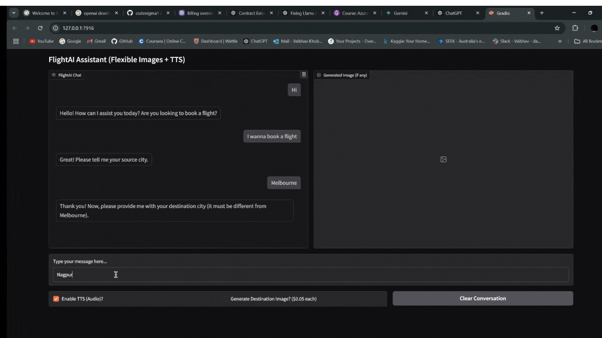
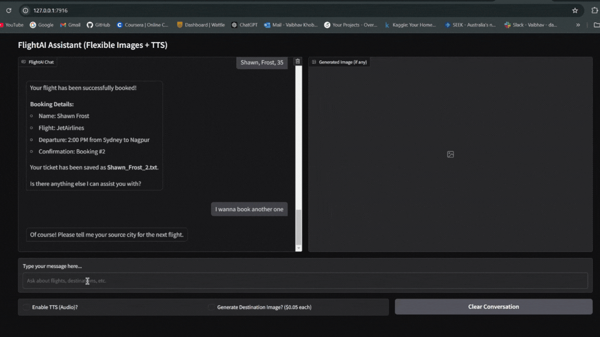
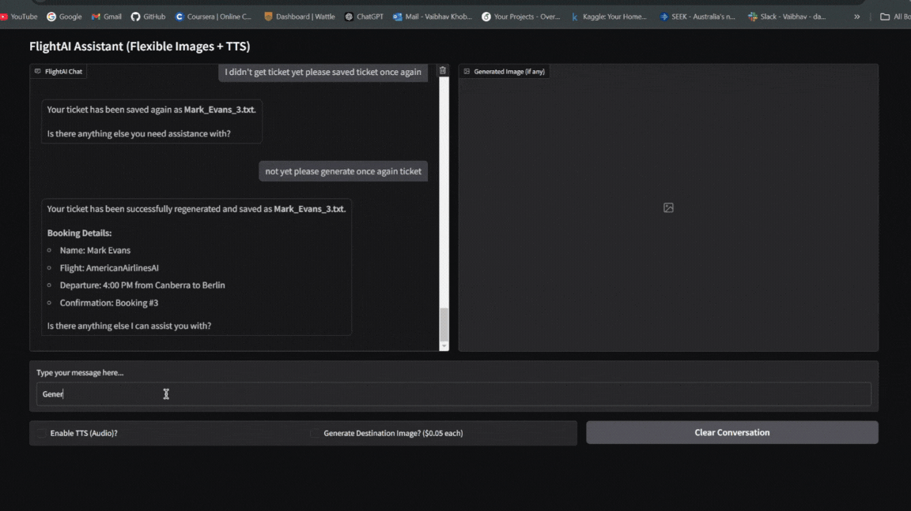

# **Airlines AI Assistant** 
A cutting-edge business application harnessing the power of Generative AI and Multimodal Models to transform airline customer experience.

## **Important Features of Airline AI Assistant**

🚀 Key Highlights:

✅ Smart Flight Booking: Real-time availability, seamless ticket generation, and automated seat assignment.

✅ Destination Visuals: AI-generated destination images for enhanced customer engagement. 🖼️

✅ Interactive Chat: Polished Gradio-powered conversations with optional text-to-speech. 💬🔊

✅ Business-Driven Insights: Auto-generated booking summaries for streamlined operations. 📊

✅ Error-Free Experience: Robust validations and user-friendly responses. 🛡️

### **Results as GIFs:**

1. **Destination Image Generation**:

2. **AI Airline Assistance Demo**:

3. **Summary Report Generation**:

### ✈️ **Flight Availability**
- Check available flights to a destination with:
  - Airline name, departure time, price, and duration.
- Alerts user if no flights are found.

### 🛫 **Step-by-step Flight Booking**
- Guides users through:
  1. Selecting source and destination cities.
  2. Choosing a flight option.
  3. Providing passenger details (name, age).
- Ensures source and destination are not the same.

### 🌛 **Ticket Generation**
- Creates a unique ticket file: firstName_lastName_bookingNumber.txt.
- Ticket includes:
  - Passenger details
  - Flight details (airline, time, price, seat number)

### 📊 **Generate Summary Report**
- Summarizes all bookings into a single file: summary_report.txt.
- Includes all flight and passenger details for review or administration.

### 🪑 **Automated Seat Assignment**
- Assigns a random but consistent seat number for each booking.
- Ensures unique seats for each flight.

### 💬 **Interactive Chat Interface**
- Real-time conversation via Gradio.
- Provides clear, polite responses based on user input.

### 🛠️ **Modular Tool Support**
- Integrated tools for:
  - Checking flight availability
  - Booking flights
  - Generating reports
- Easily extensible for future features.

### 🖼️ **Destination Image Generation**
- Generates a pop-art-style image of the user's destination city using AI.
- Images are displayed in real-time for enhanced user experience.
- Triggered when booking a flight or requesting a destination-specific image.

### 🔊 **Text-to-Speech (TTS) Support**
- Converts the assistant's responses into speech for accessibility.
- Offers an optional TTS feature for audio playback of replies.

### 🛡️ **Error Handling**
- Validates user inputs and prevents invalid bookings.
- Graceful error messages for smooth user experience.

---